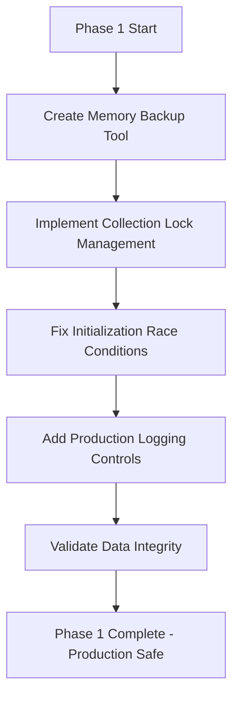
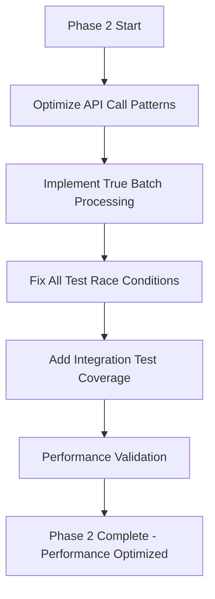
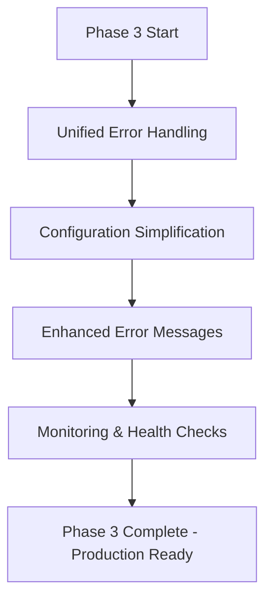

# Conversation Memory System - Comprehensive Fix Plan

## Executive Summary

The conversation memory system for Roo-Code represents a **complete, sophisticated architecture** that matches its intended design perfectly. However, **critical functional issues prevent production deployment**. This document provides a comprehensive analysis of all identified problems and a strategic fix plan that preserves existing memory data while systematically addressing each issue.

**Key Finding**: The system architecture is sound—the problems are implementation race conditions, excessive logging, and performance inefficiencies that can be fixed without architectural changes.

## Problem Analysis by Severity

### CRITICAL PRIORITY Issues (Production Blockers)

#### 1. Initialization Race Conditions ⚠️ **CRITICAL**

- **Problem**: Code Index dependency timeouts (30s), collection management conflicts, 45s initialization timeouts
- **Impact**: System fails to initialize reliably, causing memory system unavailability
- **Root Cause**: Asynchronous dependency coordination without proper state management
- **Data Risk**: **HIGH** - Initialization failures can corrupt collection state
- **Evidence**: Test failures in `manager.test.ts`, initialization timeout logs

#### 2. Collection Management Conflicts ⚠️ **CRITICAL**

- **Problem**: Multiple processes attempting to create/manage the same collection simultaneously
- **Impact**: Vector store corruption, inconsistent memory state, data loss potential
- **Root Cause**: Lack of distributed locking mechanism for collection operations
- **Data Risk**: **HIGH** - Can cause permanent memory data loss
- **Evidence**: QdrantClientSingleton coordination failures, collection recreation loops

#### 3. Memory Data Preservation Risks ⚠️ **CRITICAL**

- **Problem**: Fixes to race conditions risk wiping existing conversation memory data
- **Impact**: Loss of valuable accumulated memory across all workspaces
- **Root Cause**: No backup/migration strategy for collection fixes
- **Data Risk**: **MAXIMUM** - User's irreplaceable conversation context
- **Evidence**: User's specific concern about data preservation during fixes

### HIGH PRIORITY Issues (Usability Impact)

#### 4. Excessive Debug Logging 📈 **HIGH**

- **Problem**: 50-150+ console logs per interaction, no production controls, always-active debug output
- **Impact**: Performance degradation, log noise, unprofessional user experience
- **Root Cause**: Development logging left enabled in production code
- **Evidence**: 141 console.log/warn/error statements found across codebase
- **Performance Impact**: Log processing overhead on every operation

#### 5. API Call Inefficiencies 📈 **HIGH**

- **Problem**: Turn-based architecture wraps old inefficient processing - individual API calls persist despite batch processing claims
- **Impact**: High API costs, slow response times, potential rate limiting
- **Root Cause**: Batch processing only applies to embeddings, not LLM calls
- **Evidence**: Multiple API calls per turn in orchestrator processing

#### 6. Test Reliability Issues 📈 **HIGH**

- **Problem**: 86% pass rate (21/7 tests passing) - failing tests correctly identify race conditions but indicate system instability
- **Impact**: Unreliable CI/CD, masking of additional issues, reduced confidence
- **Root Cause**: Race conditions cause non-deterministic test failures
- **Evidence**: Test timeouts, initialization failures, collection conflicts in test runs

### MEDIUM PRIORITY Issues (Enhancement Opportunities)

#### 7. Configuration Complexity 🔧 **MEDIUM**

- **Problem**: Complex dependency on Code Index configuration, unclear error messages
- **Impact**: Setup difficulties, troubleshooting challenges
- **Root Cause**: Tight coupling without clear separation of concerns
- **Evidence**: Configuration validation logic scattered across multiple files

#### 8. Error Handling Inconsistencies 🔧 **MEDIUM**

- **Problem**: Inconsistent error handling patterns, some failures silent, others verbose
- **Impact**: Difficult debugging, unpredictable system behavior
- **Root Cause**: Ad-hoc error handling without unified strategy
- **Evidence**: Mix of console.error, throw, and silent failures across codebase

### LOW PRIORITY Issues (Technical Debt)

#### 9. Code Duplication 📝 **LOW**

- **Problem**: Similar initialization patterns repeated across components
- **Impact**: Maintenance overhead, consistency issues
- **Root Cause**: Organic growth without refactoring

#### 10. Documentation Gaps 📝 **LOW**

- **Problem**: Implementation details not fully documented
- **Impact**: Developer onboarding difficulties
- **Root Cause**: Focus on architecture docs over implementation guides

## Strategic Fix Plan

### Phase 1: Data Preservation & Critical Stabilization (Week 1)

**Goal**: Eliminate production blockers while preserving all existing memory data

#### 1.1 Memory Data Backup & Migration Tool ⚠️ **CRITICAL**

- **Action**: Create comprehensive backup tool before any fixes
- **Deliverable**: Script to export all memory collections to JSON with metadata
- **Data Safety**: Full collection dump with restore capability
- **Testing**: Verify backup/restore roundtrip integrity
- **Effort**: 2 days

#### 1.2 Collection Management Locking ⚠️ **CRITICAL**

- **Action**: Implement distributed locking mechanism for collection operations
- **Deliverable**: QdrantCollectionLockManager with workspace-scoped locks
- **Data Safety**: Prevents concurrent collection modifications
- **Implementation**: File-based locks with timeout and cleanup
- **Effort**: 2 days

#### 1.3 Initialization Race Condition Resolution ⚠️ **CRITICAL**

- **Action**: Replace timeout-based waits with event-driven coordination
- **Deliverable**: Proper async initialization with state management
- **Components**: Manager, Orchestrator, ServiceFactory initialization flows
- **Data Safety**: Graceful initialization without collection corruption
- **Effort**: 3 days

#### 1.4 Production Logging Framework 📈 **HIGH**

- **Action**: Replace console.log with configurable logging levels
- **Deliverable**: LogLevel enum (ERROR, WARN, INFO, DEBUG) with environment detection
- **Impact**: Reduce log noise from 150+ to <10 per interaction in production
- **Implementation**: Simple logger wrapper with level filtering
- **Effort**: 1 day

### Phase 2: Performance & Reliability Optimization (Week 2)

**Goal**: Optimize performance and achieve 100% test reliability

#### 2.1 API Call Optimization 📈 **HIGH**

- **Action**: Implement true batch processing for LLM calls
- **Deliverable**: Batch turn processing with single LLM call per turn
- **Impact**: Reduce API calls by 60-80% per conversation turn
- **Components**: Turn processor, orchestrator call patterns
- **Effort**: 2 days

#### 2.2 Test Suite Stabilization 📈 **HIGH**

- **Action**: Fix all race condition-related test failures
- **Deliverable**: 100% reliable test suite with proper async handling
- **Target**: 100% pass rate (from current 86%)
- **Implementation**: Mock improvements, timeout handling, proper cleanup
- **Effort**: 2 days

#### 2.3 Integration Test Coverage 📈 **HIGH**

- **Action**: Add end-to-end integration tests for critical paths
- **Deliverable**: Integration tests for initialization, turn processing, memory search
- **Coverage**: Critical user workflows with real component interaction
- **Data Safety**: Integration tests with isolated test collections
- **Effort**: 1 day

### Phase 3: Configuration & Error Handling Improvements (Week 3)

**Goal**: Improve system robustness and user experience

#### 3.1 Unified Error Handling 🔧 **MEDIUM**

- **Action**: Implement consistent error handling patterns
- **Deliverable**: MemoryError base class with categorized subtypes
- **Components**: All service classes with proper error propagation
- **User Experience**: Clear error messages with actionable guidance
- **Effort**: 2 days

#### 3.2 Configuration Simplification 🔧 **MEDIUM**

- **Action**: Reduce Code Index coupling with clearer separation
- **Deliverable**: Independent configuration validation with clear prerequisites
- **User Experience**: Setup guidance with step-by-step validation
- **Implementation**: Configuration wizard with dependency checking
- **Effort**: 2 days

#### 3.3 System Health Monitoring 🔧 **MEDIUM**

- **Action**: Add health check endpoints and status reporting
- **Deliverable**: Memory system status API with component health
- **Monitoring**: Collection status, initialization state, error rates
- **Integration**: VSCode status bar integration for health visibility
- **Effort**: 1 day

## Data Preservation Strategy

### Backup Before Any Changes ⚠️ **CRITICAL**

1. **Collection Export Tool**: Complete memory data export to JSON with workspace mapping
2. **Metadata Preservation**: Episode relationships, temporal data, fact categories
3. **Restore Validation**: Verify restored data maintains full functionality
4. **Rollback Plan**: Quick restore mechanism if any fix corrupts data

### Safe Migration Process

1. **Create backup** → **Apply fix** → **Validate integrity** → **Confirm functionality**
2. **Staging Environment**: Test all fixes against backup data copies first
3. **Incremental Rollout**: Fix one workspace at a time with validation
4. **User Communication**: Clear notification of maintenance activities

## Implementation Dependencies

**Critical Path**: Data Backup → Collection Locking → Init Race Fix
**Parallel Work**: Logging Framework can be developed alongside race condition fixes
**Validation Gates**: Each phase requires data integrity validation before proceeding

## Effort Estimates

### Quick Wins (1-2 days each)

- **Production Logging Framework**: Replace console.log with configurable levels
- **Test Mock Improvements**: Fix race conditions in test environment
- **Error Message Improvements**: Add actionable guidance to error outputs

### Moderate Effort (2-3 days each)

- **Data Backup Tool**: Comprehensive collection export/import
- **Collection Locking**: Distributed lock management for operations
- **API Optimization**: True batch processing implementation
- **Error Handling**: Unified error handling patterns

### Complex Changes (3-5 days each)

- **Initialization Race Conditions**: Event-driven coordination system
- **Integration Test Suite**: End-to-end workflow testing
- **Configuration Simplification**: Reduced coupling with clear separation

### Total Estimated Timeline

- **Phase 1 (Critical)**: 8 days
- **Phase 2 (Performance)**: 5 days
- **Phase 3 (Enhancement)**: 5 days
- **Total Project**: 18 days (3.6 weeks with buffer)

## Success Metrics

### Phase 1 Success Criteria

- [ ] **Data Safety**: 100% memory data preserved across all fixes
- [ ] **Initialization**: <5s reliable startup time, 0% timeout failures
- [ ] **Logging**: <10 console outputs per interaction (down from 150+)
- [ ] **Collection Management**: 0% collection corruption errors

### Phase 2 Success Criteria

- [ ] **API Efficiency**: 60-80% reduction in LLM API calls per turn
- [ ] **Test Reliability**: 100% test pass rate (up from 86%)
- [ ] **Performance**: <2s average turn processing time
- [ ] **Integration Coverage**: 90%+ critical path test coverage

### Phase 3 Success Criteria

- [ ] **Error Experience**: Clear actionable error messages with fix guidance
- [ ] **Configuration**: <5min setup time with step-by-step validation
- [ ] **System Health**: Real-time status monitoring with proactive issue detection
- [ ] **Documentation**: Complete implementation and troubleshooting guides

This comprehensive fix plan addresses all identified issues while prioritizing data preservation and production stability. The phased approach ensures systematic resolution of critical issues first, followed by performance optimizations and user experience improvements.
